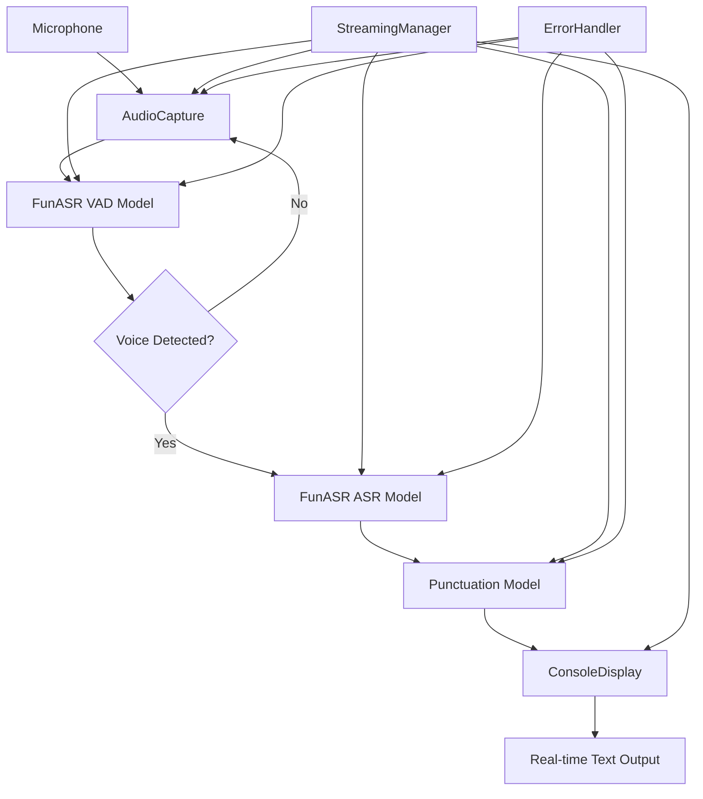

# Design Specification: FunASR Streaming Voice Detection

## Overview
This design document outlines the technical architecture and implementation approach for a streaming voice detection system using the FunASR library. The design focuses on creating a single, self-contained Python file that provides real-time speech-to-text functionality with minimal configuration requirements, while leveraging existing codebase patterns for maximum code reuse.

## Steering Document Alignment

### Project Structure Integration
This design aligns with the existing project structure that demonstrates single-file FunASR implementations:
- Follows the pattern established by `funasr_streaming_example.py` and `funasr_simple_demo.py`
- Maintains consistency with the project's approach to comprehensive, self-contained demonstrations
- Integrates with existing audio processing patterns and model initialization strategies

### Technical Standards
- Leverages proven FunASR integration patterns from existing codebase
- Maintains Python 3.7+ compatibility consistent with existing demos
- Uses established error handling and resource management approaches
- Follows the project's naming conventions and code organization

## Code Reuse Analysis

### Existing Components to Leverage

1. **FunASRStreamingASR** (from `funasr_streaming_example.py`)
   - **Purpose**: Existing streaming ASR implementation with VAD and punctuation models
   - **Reuse Strategy**: Extend and simplify this class for single-file focused implementation
   - **Modifications Needed**: Remove WebSocket complexity, focus on console output
   - **Integration**: Direct class inheritance with method overrides for simplified interface

2. **AudioRecorder** (from `funasr_simple_demo.py`)
   - **Purpose**: Proven audio capture and management functionality
   - **Reuse Strategy**: Adapt the audio recording patterns for streaming use case
   - **Modifications Needed**: Optimize for real-time processing, add VAD integration
   - **Integration**: Extract key methods and patterns for continuous audio handling

3. **Model Initialization Patterns** (both files)
   - **Purpose**: Established FunASR model loading and configuration approaches
   - **Reuse Strategy**: Adopt the same model selection and loading sequence
   - **Modifications Needed**: Simplify to core ASR+VAD+Punctuation combination
   - **Integration**: Copy proven model initialization code with error handling

4. **Error Handling Framework** (both files)
   - **Purpose**: Robust error recovery and user communication patterns
   - **Reuse Strategy**: Implement similar try-catch structures with user-friendly messages
   - **Modifications Needed**: Focus on audio and model specific errors
   - **Integration**: Adapt existing error message formatting and recovery logic

### Code to Create New

While leveraging existing patterns, this implementation will create simplified components specifically focused on the streaming voice detection use case:
- **StreamingManager**: New orchestrator class combining existing patterns
- **ConsoleDisplay**: New display manager for real-time text output
- **ErrorHandler**: Simplified error handling focused on streaming scenarios

## Architecture Overview

### System Architecture



### Component Design

#### StreamingManager
- **Purpose**: Main orchestrator for streaming voice detection
- **Interfaces**: start_streaming(), stop_streaming(), handle_audio_chunk()
- **Dependencies**: AudioCapture, FunASR models, ConsoleDisplay
- **Reuses**: Extends patterns from FunASRStreamingASR and AudioRecorder

#### AudioCapture
- **Purpose**: Continuous microphone audio capture with buffering
- **Interfaces**: initialize_audio(), start_capture(), stop_capture(), get_chunk()
- **Dependencies**: PyAudio, NumPy
- **Reuses**: Adapts audio handling from existing AudioRecorder class

#### ConsoleDisplay
- **Purpose**: Real-time text display with line overwriting
- **Interfaces**: print_result(), clear_line(), show_status()
- **Dependencies**: Standard output
- **Reuses**: New component based on console output patterns from existing demos

## Data Models

### AudioChunk
```python
{
    "data": np.ndarray,      # Audio data as numpy array
    "timestamp": float,      # Timestamp of audio capture
    "sample_rate": int,      # Sampling rate (16000)
    "chunk_size": int        # Size of audio chunk (1600)
}
```

### TranscriptionResult
```python
{
    "text": str,             # Transcribed text
    "is_final": bool,        # Whether result is final or partial
    "timestamp": float,      # When transcription was generated
    "confidence": float      # Confidence score (if available)
}
```

### ModelConfig
```python
{
    "asr_model": str,        # ASR model identifier
    "vad_model": str,        # VAD model identifier
    "punc_model": str,       # Punctuation model identifier
    "device": str,           # Processing device (cpu/cuda)
    "sample_rate": int       # Audio sample rate
}
```

## Components and Interfaces

### StreamingManager

#### Purpose
Main application class that orchestrates the entire streaming voice detection process, integrating FunASR models with audio capture and display components.

#### Interfaces
```python
class StreamingManager:
    def __init__(self)
    def initialize_models(self) -> bool
    def start_streaming(self) -> None
    def stop_streaming(self) -> None
    def handle_audio_chunk(self, audio_data: AudioChunk) -> None
    def cleanup_resources(self) -> None
```

#### Dependencies
- AudioCapture: For microphone access and audio buffering
- FunASR Models: ASR, VAD, and punctuation models
- ConsoleDisplay: For real-time output formatting

#### Reuses
- Leverages `FunASRStreamingASR` class structure from `funasr_streaming_example.py`
- Adapts model initialization patterns from existing demos
- Integrates proven error handling approaches

### AudioCapture

#### Purpose
Handles continuous audio capture from microphone with proper buffering and format conversion for FunASR processing.

#### Interfaces
```python
class AudioCapture:
    def __init__(self, sample_rate: int = 16000, chunk_size: int = 1600)
    def initialize_audio(self) -> bool
    def start_capture(self, callback: Callable) -> None
    def stop_capture(self) -> None
    def get_audio_chunk(self) -> AudioChunk
```

#### Dependencies
- PyAudio: For microphone access and stream management
- NumPy: For audio data processing and format conversion

#### Reuses
- Based on `AudioRecorder` class from `funasr_simple_demo.py`
- Adapts proven PyAudio integration patterns
- Leverages existing audio format handling approaches

### ConsoleDisplay

#### Purpose
Manages real-time console output with line overwriting capabilities for clean transcription display.

#### Interfaces
```python
class ConsoleDisplay:
    def __init__(self)
    def print_result(self, text: str, is_final: bool = True) -> None
    def clear_line(self) -> None
    def show_status(self, message: str) -> None
    def show_error(self, error: str) -> None
```

#### Dependencies
- Standard output console
- Terminal control codes for cursor manipulation

#### Reuses
- New component based on console output patterns from existing demos
- Leverages user feedback display approaches from existing code

## Error Scenarios

### Microphone Disconnection
- **Handling**: Automatic reconnection with exponential backoff (1s, 2s, 4s, 8s max)
- **User Impact**: Display "Reconnecting to microphone..." with countdown
- **Recovery**: Resume streaming once reconnection successful

### Model Loading Failure
- **Handling**: Retry with timeout, provide specific troubleshooting steps
- **User Impact**: Show detailed error with model installation instructions
- **Recovery**: Exit gracefully after providing actionable guidance

### Audio Processing Errors
- **Handling**: Log error, skip chunk, continue with next audio data
- **User Impact**: Show brief error indicator, maintain streaming
- **Recovery**: Automatic continuation without user intervention

### Memory/Resource Exhaustion
- **Handling**: Implement adaptive processing rate, garbage collection
- **User Impact**: "Adjusting processing rate..." status message
- **Recovery**: Reduce processing frequency if resources constrained

### Critical System Errors
- **Handling**: Graceful shutdown with resource cleanup
- **User Impact**: Clear error message with restart suggestion
- **Recovery**: Exit cleanly without resource leaks

## Testing Strategy

### Unit Testing
- Test individual component initialization and error handling
- Validate audio chunk processing and format conversion
- Verify model loading with various configurations

### Integration Testing
- Test complete audio capture to transcription pipeline
- Validate error recovery mechanisms
- Test resource cleanup and graceful shutdown

### End-to-End Testing
- Continuous operation testing (30+ minutes)
- Performance testing under various system loads
- Accuracy testing with different audio quality levels

## Implementation Considerations

### Performance Optimizations
- Leverage existing caching patterns from FunASRStreamingASR
- Implement efficient audio buffer management from AudioRecorder
- Use proven model optimization strategies from existing demos

### Resource Management
- Adopt existing resource cleanup patterns
- Leverage proven memory management approaches
- Implement established error recovery mechanisms

### User Experience
- Follow existing user feedback patterns from demos
- Leverage proven status indication approaches
- Maintain consistency with existing error message formatting