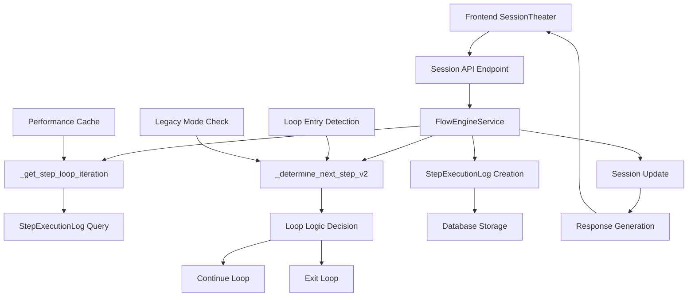
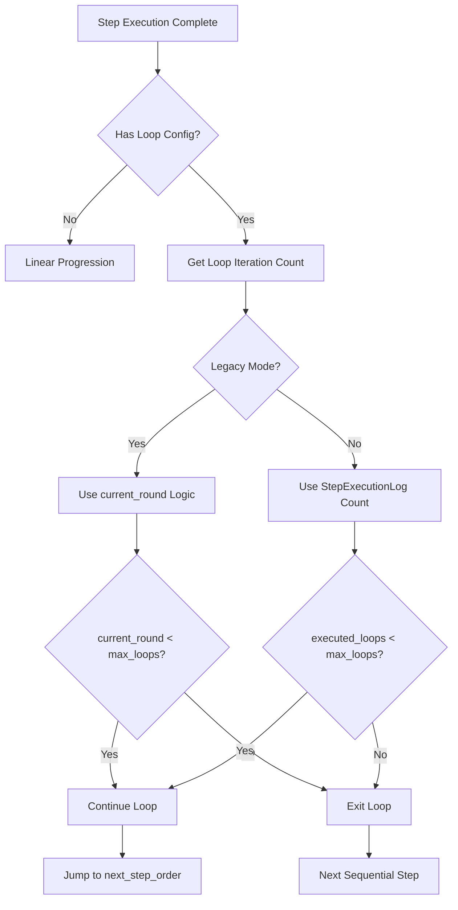
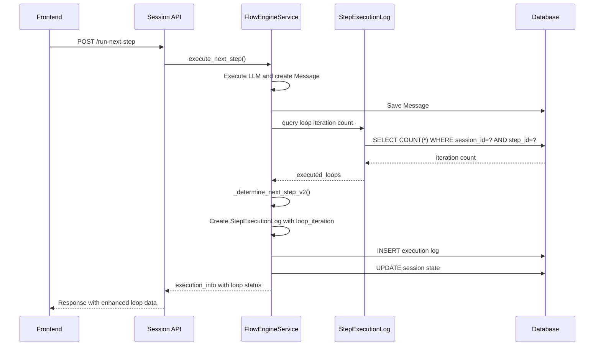

# Design Document

## Overview

This design document outlines the technical implementation for refactoring the session theater loop logic in the Multi-Role Dialogue System (MRC). The core change is moving from session-level round counting to per-step iteration counting, eliminating infinite loops while maintaining full backward compatibility.

The design leverages existing `StepExecutionLog` infrastructure with Session JSON as a fallback option, ensuring reliable loop enforcement that matches user expectations for `max_loops` configuration.

## Steering Document Alignment

### Technical Standards
The design follows established patterns in the MRC codebase:
- **Service Layer Pattern**: Encapsulates loop logic within `FlowEngineService`
- **Repository Pattern**: Uses existing SQLAlchemy models for data persistence
- **JSON Configuration**: Maintains existing `logic_config` structure for loop parameters
- **Logging and Monitoring**: Extends existing `StepExecutionLog` for comprehensive tracking

### Project Structure
Implementation follows the established file organization:
- **Services**: `backend/app/services/flow_engine_service.py` (core logic)
- **Models**: `backend/app/models/step_execution_log.py` (enhanced tracking)
- **API**: `backend/app/api/sessions.py` (interface compatibility)
- **Frontend**: `front/src/components/SessionTheater.tsx` (minimal changes)

## Code Reuse Analysis

### Existing Components to Leverage

**FlowEngineService Core Infrastructure**:
- **Location**: `backend/app/services/flow_engine_service.py`
- **Reuse**: Existing `execute_next_step()`, `_update_session_after_step_execution()`, and `_determine_next_step_v2()` methods
- **Extension**: Add `_get_step_loop_iteration()` helper function and modify loop determination logic

**StepExecutionLog Model**:
- **Location**: `backend/app/models/step_execution_log.py`
- **Reuse**: Existing `loop_iteration`, `round_index`, and `result_type` fields
- **Extension**: Enhanced utilization for per-step loop counting and status tracking

**Session Management**:
- **Location**: `backend/app/models/session.py`
- **Reuse**: Existing `current_round` and JSON field capabilities
- **Extension**: Optional `loop_counters` JSON structure for performance optimization

**Frontend SessionTheater Component**:
- **Location**: `front/src/components/SessionTheater.tsx`
- **Reuse**: Existing round display, auto-execution logic, and API integration
- **Extension**: Enhanced display of loop status and iteration counts

### Integration Points

**Database Integration**:
- **Primary**: `StepExecutionLog` queries for loop iteration counting
- **Secondary**: Session JSON fields for optional caching
- **Compatibility**: No schema changes required

**API Integration**:
- **Endpoint**: `POST /api/sessions/{session_id}/run-next-step`
- **Response**: Enhanced `execution_info.flow_logic_applied` with loop status
- **Backward Compatibility**: Existing response structure preserved

**LLM Integration**:
- **Pattern**: No changes required to LLM calling patterns
- **Context**: Loop state transparent to LLM interactions
- **Performance**: No impact on LLM response times

## Architecture

### High-Level Architecture



### Loop Decision Flow



### Data Flow Architecture



## Components and Interfaces

### Component 1: FlowEngineService Loop Logic

**Purpose**: Core engine for loop detection and iteration counting

**Location**: `backend/app/services/flow_engine_service.py`

**Key Methods**:
```python
@staticmethod
def _get_step_loop_iteration(session: Session, current_step: FlowStep) -> int:
    """Get current loop iteration count for a step (0-based)"""

@staticmethod
def _determine_next_step_v2(session: Session, current_step: FlowStep) -> Optional[int]:
    """Enhanced next step determination with per-step loop counting"""

def execute_next_step(self, session_id: int) -> Dict[str, Any]:
    """Main execution method with enhanced loop tracking"""
```

**Dependencies**:
- `Session` model for state management
- `FlowStep` model for configuration access
- `StepExecutionLog` for iteration counting
- `LLMService` for conversation generation

**Reuses**:
- Existing `execute_next_step()` method structure
- Current `_determine_next_step_v2()` framework
- Existing error handling and logging patterns
- Current session and step management logic

### Component 2: Enhanced StepExecutionLog Tracking

**Purpose**: Comprehensive loop execution tracking and persistence

**Location**: `backend/app/models/step_execution_log.py`

**Enhanced Field Usage**:
```python
class StepExecutionLog(db.Model):
    # Existing fields with enhanced loop tracking:
    loop_iteration = db.Column(db.Integer, default=0)  # Per-step iteration count
    result_type = db.Column(db.String(50))  # Enhanced: 'loop_continue', 'loop_break'

    @classmethod
    def get_step_iteration_count(cls, session_id: int, step_id: int) -> int:
        """Get total execution count for loop counting"""

    def is_loop_iteration(self) -> bool:
        """Enhanced detection of loop vs initial execution"""
```

**Dependencies**:
- SQLAlchemy ORM for database operations
- Session model for relationship mapping
- FlowStep model for step identification

**Reuses**:
- Existing model structure and database schema
- Current logging and relationship patterns
- Existing query methods and utilities

### Component 3: Loop Configuration Management

**Purpose**: Handle loop parameter configuration and validation

**Location**: `backend/app/services/flow_engine_service.py` (integrated)

**Configuration Structure**:
```python
@dataclass
class LoopConfig:
    next_step_order: Optional[int] = None
    max_loops: Optional[int] = None
    loop_mode: str = "iteration"  # "iteration" | "round" (legacy)

    @classmethod
    def from_step(cls, step: FlowStep) -> 'LoopConfig':
        """Extract loop config from step.logic_config"""

    def is_loop_configured(self) -> bool:
        """Check if step has valid loop configuration"""

    def should_continue_loop(self, executed_loops: int, current_round: int = None) -> bool:
        """Determine if loop should continue based on mode"""
```

**Dependencies**:
- FlowStep model for configuration access
- JSON validation utilities
- Existing configuration patterns

**Reuses**:
- Current `logic_config` JSON structure
- Existing validation and error handling
- Current configuration management patterns

### Component 4: Enhanced API Response Structure

**Purpose**: Provide comprehensive loop status information to frontend

**Location**: `backend/app/api/sessions.py` (enhanced)

**Response Enhancement**:
```python
class ExecutionInfo:
    flow_logic_applied: Dict[str, Any] = {
        'next_step_order': Optional[int],
        'exit_condition_met': bool,
        'max_loops_reached': bool,
        'executed_loops': int,  # New: current iteration count
        'max_loops': int,      # New: configured limit
        'loop_mode': str       # New: iteration/round mode
    }
```

**Dependencies**:
- Existing response structure
- Session API framework
- JSON serialization utilities

**Reuses**:
- Current `ExecutionInfo` structure
- Existing API response patterns
- Current error handling and validation

## Data Models

### Enhanced Loop State Model

**Primary Approach: StepExecutionLog-based Counting**
```python
# Query pattern for loop iteration counting:
executed_loops = StepExecutionLog.query.filter_by(
    session_id=session.id,
    step_id=current_step.id
).count()

# New execution log creation:
execution_log = StepExecutionLog(
    session_id=session.id,
    step_id=current_step.id,
    round_index=session.current_round,
    loop_iteration=executed_loops,  # 0-based iteration count
    result_type='loop_continue' if continuing else 'loop_break'
)
```

**Secondary Approach: Session JSON Caching (Optional)**
```python
# Session.loop_counters JSON structure:
{
    "loop_counters": {
        "step_123": 3,  # Step ID -> iteration count
        "step_456": 1
    },
    "loop_cache_version": 1
}

# Usage pattern:
loop_counters = session.loop_counters or {}
executed_loops = loop_counters.get(f"step_{current_step.id}", 0)
```

### Loop Configuration Model

**FlowStep.logic_config Enhancement**:
```json
{
    "next_step_order": 2,           // Target step for loop back
    "max_loops": 3,                // Maximum iterations
    "loop_mode": "iteration",      // "iteration" (new) | "round" (legacy)
    "exit_condition": {            // Existing exit conditions
        "type": "llm_accept_flag"
    }
}
```

### Execution Result Tracking

**StepExecutionLog.result_type Values**:
- `'success'` - Normal step execution
- `'loop_continue'` - Step executed, continuing loop
- `'loop_break'` - Step executed, exiting loop
- `'loop_entry'` - First entry into loop (optional enhancement)
- `'error'` - Execution failed

## Error Handling

### Error Scenarios

**1. Loop Configuration Invalid**
- **Description**: `next_step_order` points to non-existent step
- **Handling**: Graceful fallback to linear progression, log warning
- **User Impact**: Flow continues without looping, admin notified

**2. Database Query Failures**
- **Description**: StepExecutionLog queries fail due to connection issues
- **Handling**: Fallback to Session JSON caching, degrade gracefully
- **User Impact**: Minor performance impact, loop counting continues

**3. Concurrent Access Conflicts**
- **Description**: Multiple executions updating loop counters simultaneously
- **Handling**: Database transaction isolation, retry logic with exponential backoff
- **User Impact**: Brief delays, consistent loop state maintained

**4. Legacy Mode Compatibility**
- **Description**: Old flows expecting round-based behavior
- **Handling**: Detect legacy mode via configuration, maintain old behavior
- **User Impact**: Existing flows unchanged, new flows use improved logic

**5. Loop State Corruption**
- **Description**: Inconsistent loop iteration counts due to system failures
- **Handling**: Automatic repair during session recovery, fallback to conservative estimates
- **User Impact**: Temporary loop behavior adjustment, system self-healing

### Recovery Strategies

**Automatic Recovery**:
- Database transaction rollback on failures
- Session state reconciliation on restart
- Loop counter validation and repair

**Manual Recovery**:
- Admin tools for loop state inspection
- Session repair utilities for corrupted states
- Flow re-initialization options

## Testing Strategy

### Unit Testing

**Loop Counting Logic**:
- Test `_get_step_loop_iteration()` with various database states
- Validate loop iteration counting accuracy
- Test edge cases (empty logs, concurrent access)

**Next Step Determination**:
- Test `_determine_next_step_v2()` with all loop configurations
- Validate legacy vs iteration mode behavior
- Test boundary conditions (max_loops = 0, 1, etc.)

**Configuration Management**:
- Test `LoopConfig` parsing and validation
- Test invalid configuration handling
- Test mode switching between iteration and round

### Integration Testing

**End-to-End Flow Execution**:
- Test complete flow with loop segments
- Validate loop entry, iteration, and exit
- Test multiple loop segments in single flow

**Database Integration**:
- Test StepExecutionLog creation and querying
- Test concurrent access scenarios
- Test transaction rollback and recovery

**API Integration**:
- Test enhanced response structure
- Validate backward compatibility
- Test error response handling

### Performance Testing

**Loop Counting Performance**:
- Measure query performance with large execution histories
- Test database indexing effectiveness
- Validate caching strategy impact

**Memory Usage**:
- Test memory consumption with large loop counts
- Validate garbage collection of execution logs
- Test session state memory efficiency

### End-to-End Testing Scenarios

**Test Case 1: Simple Single Loop**
```
Flow: 1 → 2 → 3 → 4
Config: Step 3: next_step_order=2, max_loops=2
Expected: 1, 2, 3, 2, 3, 4
```

**Test Case 2: Loop Without Summarize**
```
Flow: 1 → 2 → 3 → 4
Config: Step 3: next_step_order=1, max_loops=3
Task Types: No summarize/conclude in loop
Expected: 1, 2, 3, 1, 2, 3, 1, 2, 3, 4
```

**Test Case 3: Legacy Mode Compatibility**
```
Flow: 1 → 2 → 3 → 4
Config: Step 3: next_step_order=2, max_loops=2, loop_mode="round"
Expected: Behavior identical to current implementation
```

**Test Case 4: Multiple Loop Segments**
```
Flow: 1 → 2 → 3 → 4 → 5 → 6
Config: Step 3: loop to 2 (max_loops=2)
        Step 5: loop to 4 (max_loops=1)
Expected: Complex nested loop pattern with proper exit
```

**Test Case 5: Configuration Validation**
```
Flow: 1 → 2 → 3
Config: Invalid next_step_order=99 (non-existent)
Expected: Graceful fallback to linear progression
```

This design provides a robust, backward-compatible solution for eliminating infinite loops while enhancing system reliability and maintainability.