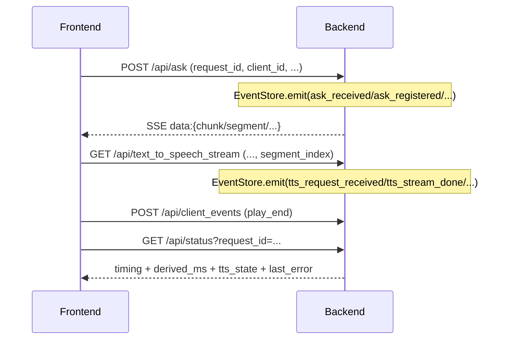

# 架构概览与扩展点（面向后续功能/重构）

本文档回答三个问题：
1) 端到端链路如何流动（文本 SSE、TTS 流、录制/回放、观测）  
2) 关键边界在哪里（哪些逻辑该放后端/前端，哪些模块负责什么）  
3) 新功能优先落点（最小改动路径、可复用的扩展点）

> 代码基准：`backend/app.py`、`backend/orchestrators/conversation_orchestrator.py`、`backend/services/*`、`fronted/src/managers/*`、`fronted/src/audio/ttsAudio.js`

## 1. 端到端数据流

### 1.1 Ask（SSE）+ TTS（音频流）

```mermaid
flowchart LR
  U[Browser UI] -->|POST /api/ask| B[Flask backend/app.py]
  B -->|SSE: data:{chunk/segment/done/meta}| U
  U -->|GET /api/text_to_speech_stream<br/>text,request_id,segment_index,tts_provider,...| B
  B -->|chunked audio bytes<br/>Content-Type: tts.mimetype| U
  U -->|WebAudio/DecodeAudioData/<audio>| SPK[Speaker]
  U -->|POST /api/client_events play_end| B
```

关键约定：
- `request_id`：一次 run 的主键（ask + 所有 segment 的 tts 都复用）
- `segment_index`：TTS 段序号（前端递增，后端校验顺序并打点）
- Ask 输出中 `segment` 的粒度由 `text_cleaning.*` 控制（偏向“可播报”的短句段落）

### 1.2 观测（events/status）



### 1.3 导览录制与回放（recordings）

当 `GET /api/text_to_speech_stream` 传入 `recording_id` + `stop_index` 时：
- 后端会把该段音频原样写入 `backend/data/recordings/<recording_id>/audio/*.wav`
- 并将元数据写入 `backend/services/recording_store.py` 的 SQLite

前端可通过 `/api/recordings/<id>/stop/<stop_index>` 获取“某站点的答案文本 + 音频 URL 列表”，用来离线回放。

## 2. 模块边界（建议）

### 2.1 后端边界

- `backend/app.py`：只做“协议层/装配层”
  - 参数校验、CORS、把 generator 包装成 SSE/音频流
  - 记录事件（EventStore）、调用 orchestrator/service

- `backend/orchestrators/conversation_orchestrator.py`：只做“编排 + 输出格式”
  - chat/agent 两种问答来源统一输出 `{chunk|segment|done|meta}`
  - 处理导览提示词约束（guide）、分段策略、历史写入触发

- `backend/services/*`：只做“可替换能力”
  - `asr_service.py`：音频预处理 + provider 适配
  - `tts_service.py`：provider 适配 + 音频流稳定性（背压/探测/连接池）
  - `ragflow_service.py` / `ragflow_agent_service.py`：RAGFlow SDK/HTTP 适配
  - `history_store.py` / `recording_store.py`：持久化
  - `request_registry.py`：取消与限流（跨 API 共用）

### 2.2 前端边界

- `AskWorkflowManager`：只做“run 生命周期”
  - 触发 ask、消费 SSE、将 segment 交给 TTS 队列、处理中断/续播/预取

- `TtsQueueManager`：只做“队列 + 顺序播放”
  - 把 segment -> 构造 URL -> 拉取/播放 -> 播完打点 `play_end`

- `ttsAudio.js`：只做“音频字节播放”
  - WebAudio streaming + fallback + WAV/PCM 假设与白噪声防护

## 3. 扩展点清单（落地建议）

### 3.1 新增一个后端能力（建议）

优先在 `backend/services/` 新建 service（或扩展已有 service），并满足：
- service 只返回“纯数据/纯字节流”，不关心 HTTP
- `backend/app.py` 负责把输入参数解析成 service 所需的结构
- 观测：在入口/关键转折点 `EventStore.emit(...)`

### 3.2 新增一个前端工作流（建议）

优先落在 `fronted/src/managers/`：
- 增加一个 manager/hook，避免把流程堆在 `App.js`
- 与后端契约变化同步更新 `doc/code/contracts.md`

### 3.3 “最容易债务化”的地方（重构优先级）

1) **契约不清**：SSE/tts query 参数随意增长 → 先写 `contracts.md` 并做版本/兼容策略  
2) **状态机不清**：中断/连续导览/回放混在一起 → 先写 `state_machine.md`，再拆分 manager  
3) **可观测性不足**：只靠 console.log → 统一事件命名与字段（`observability.md`）  

