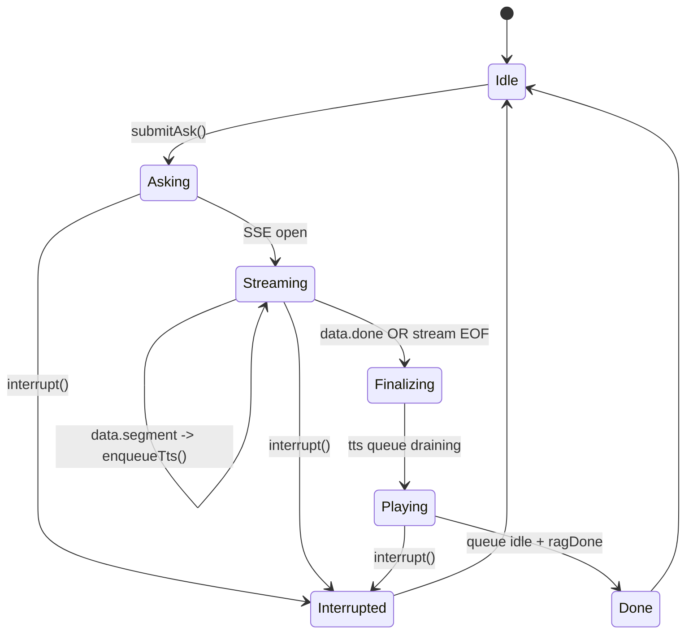
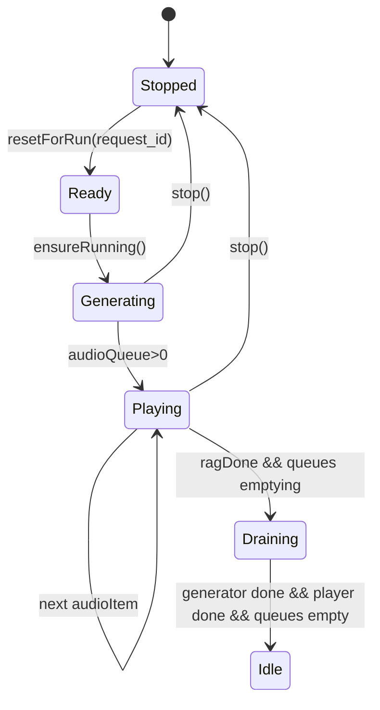

# 前端运行状态机与中断策略（重构抓手）

本文档把当前“问答 run + TTS 队列 + 导览连续播放/回放”抽象成状态机，便于后续加功能时不把逻辑堆回 `App.js`。

核心代码：
- Ask：`fronted/src/managers/AskWorkflowManager.js`
- TTS：`fronted/src/managers/TtsQueueManager.js`
- 中断协调：`fronted/src/managers/InterruptManager.js`（如存在）以及 `AskWorkflowManager.interrupt(...)`

## 1. Run 生命周期（AskWorkflowManager）

一个 run（用户提问/导览动作触发）大致分为：

实现对应点：
- SSE 读取：`AskWorkflowManager` 内部用 `ReadableStream.getReader()`，按 `data:` 行解析 JSON
- done：
  - 正常：收到 `data.done=true`
  - 异常：SSE EOF 但没 done，前端会 best-effort finalize（把 fullAnswer 当作一个 segment 兜底）

## 2. TTS 队列状态（TtsQueueManager）

队列内部拆为两个并发循环：
- generator：把 textQueue 里的 segment 转成 audioItem（URL/或预取的 wavBytes）
- player：按 audioQueue 顺序播放（WebAudio streaming + fallback）

关键约束：
- “顺序播放”是首要原则：避免并发叠音/顺序错乱
- `segment_index` 在 `_buildSegmentUrl(...)` 内递增，绑定到 `request_id`

## 3. 中断/取消（Interrupt）

### 3.1 前端中断要做的事（目标行为）

当用户触发中断（新问题/手动停止/导览切站）：
1) 停掉当前播放（stop WebAudio / <audio>）
2) 取消当前 ask SSE（AbortController）
3) best-effort 通知后端取消（`POST /api/cancel`）
4) 阻断“迟到回调”的 enqueue（防止旧 run 的 segment 混入新 run）

代码体现：
- `AskWorkflowManager.interrupt(...)` 做了上述组合动作
- `InterruptManager`（或同类）用 “epoch/runId” gating：只有当前 epoch 的回调才允许 enqueue

### 3.2 后端取消语义（对齐）

后端取消是 best-effort（`backend/services/request_registry.py`）：
- ask/asr/tts/nav 各自按 `kind` 维护 active
- 新请求会取消旧请求（同 client_id + 同 kind）

## 4. 连续导览（continuous tour）与回放

当前实现里，导览会引入额外复杂度：
- “切站”动作可能触发预取下一站文本
- “录制回放”会直接 enqueueAudioUrl（走 recorded wav 播放）

建议在后续重构时把导览逻辑明确拆分为三层：
- Run 层（AskWorkflowManager）：只负责生命周期与中断
- Pipeline 层（TourPipelineManager/TourController）：只负责“下一站/预取/回放”
- 播放层（TtsQueueManager）：只负责队列播放，不理解“站点/导览语义”

## 5. 新功能落点建议（按风险排序）

1) 新增“播放策略/格式”：优先改 `ttsAudio.js`，并同步更新 `doc/code/contracts.md`
2) 新增“run 类型”：扩展 AskWorkflowManager 的 `kind`/策略，但不要让它直接理解更多业务细节
3) 新增“导览行为”：优先落到 pipeline/controller，而不是直接写在 ask 解析循环里

